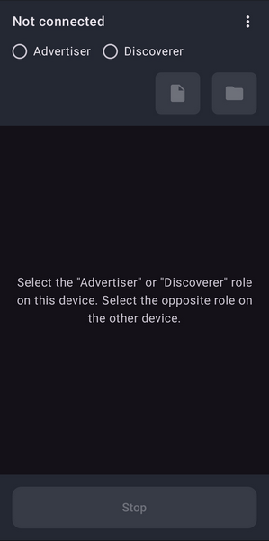
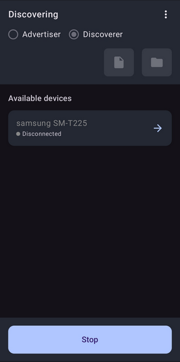
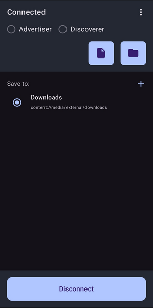
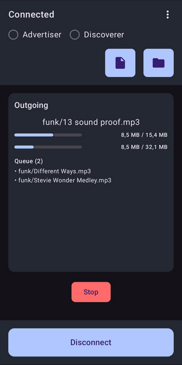

# NearbyExchanger

A lightweight Android application for sharing files between devices via Wi-Fi or Bluetooth. Transfer individual files or entire folders. No internet connection is required. The Google Nearby Connections API is used under the hood.

  
  
  
  

